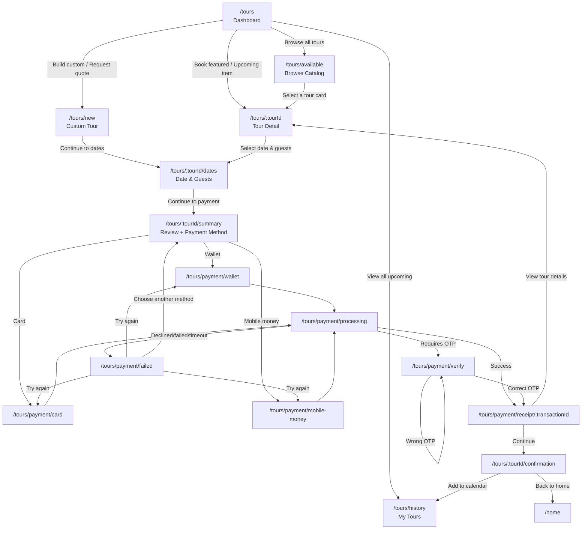

# Tours Workflow (Route + State + UI Flow)

This document maps the end-to-end Tours journey and how pages connect in the current app.

## Route Map

- `/tours` -> `ToursDashboard`
- `/tours/available` -> `ToursHomeEntryScreen`
- `/tours/new` -> `ToursNew` (custom tour / quote request)
- `/tours/:tourId` -> `TourDetail`
- `/tours/:tourId/dates` -> `TourDates`
- `/tours/:tourId/summary` -> `TourSummary`
- `/tours/payment/wallet` -> `TourPaymentWallet`
- `/tours/payment/card` -> `TourPaymentCard`
- `/tours/payment/mobile-money` -> `TourPaymentMobileMoney`
- `/tours/payment/processing` -> `TourPaymentProcessing`
- `/tours/payment/verify` -> `TourPaymentVerify`
- `/tours/payment/failed` -> `TourPaymentFailed`
- `/tours/payment/receipt/:transactionId` -> `TourPaymentReceipt`
- `/tours/:tourId/confirmation` -> `TourConfirmation`
- `/tours/history` -> `TourHistory`

## Flowchart

## Page Interconnection Notes

- Tour selection happens on dashboard, browse list, and history cards, then route enters `/:tourId`.
- `TourDates` writes booking core fields: `date`, `timeSlot`, `adults`, `children`, `guests`.
- `TourSummary` initializes payment session and sends user to gateway pages by selected method.
- `TourPaymentProcessing` drives final outcome:
  - success -> receipt
  - verification needed -> OTP page
  - failure -> failed page
- `TourPaymentReceipt` is the only page that links directly to confirmation.
- `TourHistory` is fed from persisted `tours.bookings` (confirmed/pending/failed states).

## Inputs and Buttons by Stage

- `ToursHomeEntryScreen`: search text, category chips, tour cards.
- `ToursNew`: tour type, destination, dates, group size, special requests, submit.
- `TourDates`: date input, time slot chips, adults +/- , children +/- , continue.
- `TourSummary`: payment method cards, terms checkbox, confirm & pay.
- `TourPaymentCard`: cardholder/card number/expiry/cvv/billing inputs, pay now.
- `TourPaymentMobileMoney`: provider + phone, send payment prompt.
- `TourPaymentWallet`: wallet validation + pay button.
- `TourPaymentVerify`: OTP input, verify button.

## State Machine (High-Level)

- Booking status:
  - `draft` -> `pending_payment` -> `confirmed`
  - `pending_payment` -> `failed_payment` (if gateway fails)
- Payment status:
  - `pending` -> `processing` -> `successful`
  - `processing` -> `requires_verification` -> `successful`
  - `processing` -> `failed|declined|timeout|insufficient_funds`

## Gaps Fixed

The following gaps were patched:

- Booking details persistence:
  - Added `timeSlot`, `adults`, `children` to `TourBooking`.
  - `TourDates` now persists those values into shared booking state.
  - `TourSummary` now reads from persisted booking state first (route state is fallback).
  - `TourConfirmation` now displays persisted `timeSlot`.
- Custom-tour handoff:
  - `TourDates` now pre-fills date/group when opened from `/tours/new`.
- Payment-method switching:
  - `TourPaymentWallet` “Choose another payment method” now returns to
    `/:tourId/summary` (instead of generic `/tours`) when possible.
